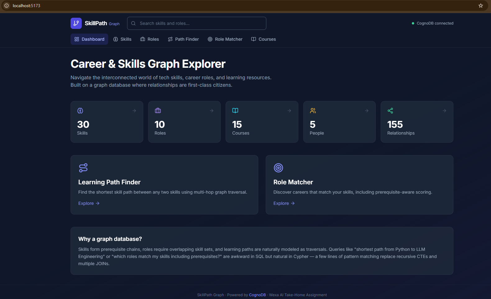
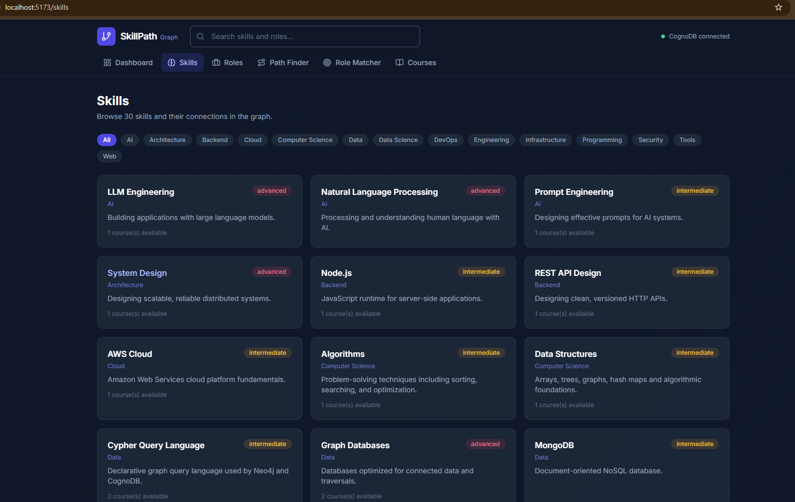
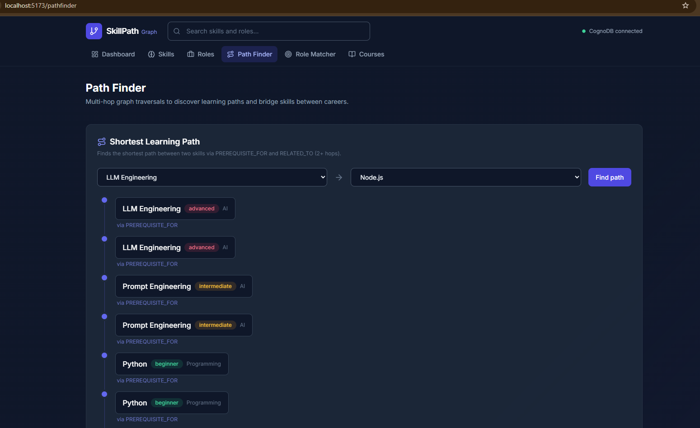

# SkillPath Graph

**A career & skills pathfinder backed by [CognoDB](https://cognodb.com) — a graph database that speaks openCypher over Bolt.**

Explore how tech skills connect, find learning paths between skills, match your skills to careers, and discover bridge skills between roles — all powered by graph traversals that would be awkward in SQL.

> **Live demo:** _Add your Render/Railway URL after deployment_  
> **Screen recording:** _Add Loom/YouTube link before submission_

---

## Why a graph database?

SkillPath models a **network**, not a spreadsheet:

| Question | Relational approach | Graph approach |
|----------|--------------------|----------------|
| "What's the shortest learning path from Python to LLM Engineering?" | Recursive CTEs, multiple self-joins on a prerequisite table, path reconstruction in application code | `shortestPath((a)-[:PREREQUISITE_FOR*..8]-(b))` — one Cypher pattern |
| "Which roles match my skills, counting prerequisites I've already mastered?" | JOIN skills → prerequisites (up to N levels) → role requirements, weighted scoring in SQL | Traverse `PREREQUISITE_FOR*1..4` in a single parameterized query |
| "What skills bridge Frontend Developer and Graph Data Engineer?" | Cross-product of role skill sets + path finding between each pair | Multi-hop traversal between role requirement nodes |

**Relationships are first-class.** A skill's prerequisites, the roles that require it, and the courses that teach it are typed edges — not foreign keys buried in join tables. Traversals are the query primitive, which matches how people actually think about career planning: "If I know X, what can I learn next?" and "How do I get from A to B?"

---

## Data model

```
┌─────────────┐     PREREQUISITE_FOR      ┌─────────────┐
│    Skill    │ ─────────────────────────►│    Skill    │
│             │◄─────────────────────────│             │
└──────┬──────┘     RELATED_TO (both)     └──────┬──────┘
       │                                          │
       │ TEACHES                          REQUIRES │
       ▼                                          ▼
┌─────────────┐                          ┌─────────────┐
│   Course    │                          │    Role     │
└─────────────┘                          └──────┬──────┘
                                                │
┌─────────────┐     HAS_SKILL            HELD_ROLE │
│   Person    │ ───────────────────► Skill    ◄──────┘
└─────────────┘
```

### Node labels & properties

| Label | Properties | Count (seed) |
|-------|-----------|--------------|
| `Skill` | `id`, `name`, `category`, `description`, `difficulty` | 30 |
| `Role` | `id`, `name`, `description`, `level`, `salaryMin`, `salaryMax` | 10 |
| `Course` | `id`, `name`, `provider`, `durationHours`, `url` | 15 |
| `Person` | `id`, `name`, `bio` | 5 |

### Relationship types

| Type | From → To | Properties |
|------|-----------|------------|
| `PREREQUISITE_FOR` | Skill → Skill | — |
| `RELATED_TO` | Skill ↔ Skill | bidirectional |
| `REQUIRES` | Role → Skill | `importance`: essential \| recommended |
| `TEACHES` | Course → Skill | `proficiency`: beginner \| intermediate \| advanced |
| `HAS_SKILL` | Person → Skill | `level`: 1–5 |
| `HELD_ROLE` | Person → Role | `years` |

---

## Main Cypher queries

All queries live in [`server/src/db/queries.ts`](server/src/db/queries.ts) and use **parameterized** `$variables` via the official Neo4j JavaScript driver — no string concatenation.

### 1. Shortest learning path (multi-hop, 2+ hops)

Finds the shortest path between two skills through prerequisite and related-skill edges:

```cypher
MATCH (start:Skill {id: $fromSkillId}), (end:Skill {id: $toSkillId})
MATCH path = shortestPath(
  (start)-[:PREREQUISITE_FOR|RELATED_TO*..8]-(end)
)
RETURN nodes(path), relationships(path)
```

**Example:** Python → Statistics → Machine Learning → Deep Learning → NLP → LLM Engineering (5 hops)

**UI:** Path Finder page (`/pathfinder`)

### 2. Role matcher with prerequisite-aware scoring (relationally awkward)

Scores roles by matching user skills **and** skills connected via up to 4 prerequisite hops:

```cypher
UNWIND $skillIds AS skillId
MATCH (userSkill:Skill {id: skillId})
WITH collect(userSkill) AS userSkills

MATCH (r:Role)-[req:REQUIRES]->(needed:Skill)
-- For each required skill, check if user has it OR a prerequisite within 4 hops
OPTIONAL MATCH (us:Skill)
WHERE us IN userSkills
  AND (us = needed OR (us)-[:PREREQUISITE_FOR*1..4]->(needed))
-- Weight essential skills 2×, compute match percentage
```

**UI:** Role Matcher page (`/matcher`)

### 3. Bridge skills between two roles (multi-hop)

Finds skills on shortest paths between the skill requirements of two different careers:

```cypher
MATCH (r1:Role {id: $roleId1})-[:REQUIRES]->(s1:Skill)
MATCH (r2:Role {id: $roleId2})-[:REQUIRES]->(s2:Skill)
MATCH path = shortestPath((s1)-[:PREREQUISITE_FOR|RELATED_TO*..5]-(s2))
RETURN DISTINCT nodes(path) AS bridgeSkills
```

**UI:** Path Finder → Bridge Skills section

---

## Tech stack

| Layer | Technology |
|-------|-----------|
| Database | [CognoDB Cloud](https://console.cognodb.com) (Bolt 5.x, openCypher) |
| Driver | [neo4j-driver](https://www.npmjs.com/package/neo4j-driver) v5 (official Neo4j JS driver) |
| Backend | Node.js, Express, TypeScript |
| Frontend | React 18, Vite, Tailwind CSS, React Router |
| Hosting | [Vercel](https://vercel.com) (serverless API + static frontend) |

---

## Prerequisites

- **Node.js** 18+
- **CognoDB Cloud** free instance ([sign up](https://console.cognodb.com/signup))

---

## Setup

### 1. Create a CognoDB instance

1. Go to [console.cognodb.com/signup](https://console.cognodb.com/signup) and create an account (no credit card).
2. Create a **free (c0)** instance and pick a region.
3. Copy the connection URI (`bolt+s://<instance-id>.databases.cognodb.cloud`) and password.
   - Username is always `cognodb`.
   - **The password is shown once** — save it immediately.

### 2. Clone and configure

```bash
git clone <your-repo-url>
cd skillpath-graph
cp .env.example .env
```

Edit `.env`:

```env
COGNODB_URI=bolt+s://your-instance-id.databases.cognodb.cloud
COGNODB_USERNAME=cognodb
COGNODB_PASSWORD=your-generated-password
PORT=3001
```

### 3. Install dependencies

```bash
npm install
```

### 4. Seed the database

```bash
npm run seed
```

Expected output:

```
Connected to CognoDB.
Creating 30 skills...
Creating 10 roles...
...
Relationship counts:
  PREREQUISITE_FOR: 24
  REQUIRES: 52
  ...
```

### 5. Run locally

```bash
npm run dev
```

- **Frontend:** http://localhost:5173 (proxies API to backend)
- **Backend API:** http://localhost:3001/api/health

### 6. Production build

```bash
npm run build
npm start
```

Serves the built React app and API from port 3001.

---

## Project structure

```
skillpath-graph/
├── api/                    # Vercel serverless entry (Express API)
│   └── index.ts
├── client/                 # React frontend (Vite + Tailwind)
│   └── src/
│       ├── api/            # API client
│       ├── components/     # Layout, UI states
│       └── pages/          # Dashboard, Skills, Path Finder, etc.
├── server/
│   └── src/
│       ├── app.ts          # Express app (shared: Vercel + local)
│       ├── db/
│       │   ├── driver.ts   # Neo4j driver + connection handling
│       │   └── queries.ts  # All parameterized Cypher queries
│       ├── routes/         # Express API routes
│       └── seed/           # Seed data + loader script
├── docs/screenshots/       # UI screenshots for README
├── .env.example
├── vercel.json             # Vercel deployment config
└── README.md
```

---

## API endpoints

| Method | Path | Description |
|--------|------|-------------|
| GET | `/api/health` | DB connectivity check |
| GET | `/api/stats` | Graph node/relationship counts |
| GET | `/api/skills` | List skills (optional `?category=`) |
| GET | `/api/skills/:id` | Skill detail with prerequisites |
| GET | `/api/roles` | List career roles |
| GET | `/api/paths/learning?from=&to=` | Shortest learning path |
| POST | `/api/roles/match` | Match skills to roles (`{ skillIds: [] }`) |
| GET | `/api/paths/bridge?role1=&role2=` | Bridge skills between roles |
| GET | `/api/search?q=` | Search skills and roles |

---

## Error handling

When CognoDB is unreachable, the API returns **503** with `{ code: "DATABASE_UNAVAILABLE" }`. The UI shows a dedicated error state with retry button and setup hints — no silent failures or blank screens.

---

## Deployment (Vercel)

SkillPath deploys to **Vercel** as a single project:
- **Frontend** → static files from `client/dist`
- **API** → serverless Express function at `/api/*` (via `api/index.ts`)

No credit card required on the Vercel Hobby plan.

### 1. Push to GitHub

Ensure `.env` is **not** committed (only `.env.example`).

### 2. Import to Vercel

1. Go to [vercel.com](https://vercel.com) and sign up with GitHub
2. Click **Add New → Project**
3. Import your `skillpath-graph` repository
4. **Important:** Under **Root Directory**, leave it as **`.`** (repo root) — do **not** set it to `server` or `client`
5. Vercel reads `vercel.json` automatically — no build settings to change:
   - **Build Command:** `npm --workspace skillpath-client run build`
   - **Output Directory:** `client/dist`
   - **Install Command:** `npm install`

### 3. Environment variables (required)

In **Project Settings → Environment Variables**, add for **Production** and **Preview**:

| Name | Value |
|------|--------|
| `COGNODB_URI` | `bolt+s://your-instance.databases.cognodb.com` |
| `COGNODB_USERNAME` | `cognodb` |
| `COGNODB_PASSWORD` | your CognoDB password |
| `NODE_ENV` | `production` |

> Without these, the UI loads but every API call fails. Local `.env` is **never** uploaded to Vercel.

After saving variables, click **Redeploy** (env changes do not apply to old deployments).

### 4. Deploy

Click **Deploy**. First deploy takes ~2–3 minutes.

Build runs: `npm run bundle:api` (CJS API bundle) → client Vite build.

### 5. Seed data (one-time, run locally)

The seed script connects to your **cloud** CognoDB instance — run once from your machine:

```bash
npm run seed
```

### 6. Verify

Open your Vercel URL (e.g. `https://skillpath-graph.vercel.app`):

- Dashboard shows graph stats
- Header: **CognoDB connected** (green)
- Path Finder and Role Matcher work
- `/api/health` returns `{ "status": "healthy" }`

### Troubleshooting

`GET /api/diagnostics` reports configuration and network reachability without
exposing secrets — the fastest way to tell a config problem from a network one:

```json
{
  "runtime": "vercel",
  "env": { "COGNODB_URI": "bolt+s://db-…cognodb.com", "COGNODB_PASSWORD": "set" },
  "configErrors": [],
  "network": {
    "dns": { "ok": true, "addresses": ["8.234.181.95 (IPv4)"], "ms": 7 },
    "tcp": { "ok": true, "ms": 278 },
    "tls": { "ok": true, "ms": 749 }
  }
}
```

| Symptom | Cause | Fix |
|---------|-------|-----|
| `COGNODB_PASSWORD: null` | Env vars not applied to this environment | Add them in Vercel, then **Redeploy** |
| `dns.ok: false` | Hostname wrong or unresolvable | Re-copy the URI from the CognoDB console |
| `tcp.ok: false` | Port 7687 blocked or instance stopped | Confirm the instance is running |
| `tls.ok: false` | Certificate/scheme mismatch | Ensure the URI uses `bolt+s://` |
| All `ok` but queries fail | Wrong password | Reset the password in CognoDB and update Vercel |

Run the same probe locally with `npm run test:probe -w server`.

To exercise the deployed code path before pushing, `npm run verify:vercel` builds the
API bundle and invokes it exactly as Vercel does — `handler(req, res)` — asserting that
`/api/diagnostics`, `/api/health`, and `/api/stats` all return JSON.

### Notes

- **Root Directory must be empty** (repo root). If the build fails with `Missing script: build:vercel` in `skillpath-server`, clear **Project Settings → General → Root Directory** and redeploy.
- **Timeout budget:** connect 4s, query 7s, function 30s — the database always fails before the platform does, so errors arrive as JSON rather than a 504.
- **Cold starts:** the first request after idle may take a few seconds; the driver is cached across warm invocations.
- **Do not set `VITE_API_URL`** on Vercel — the client uses same-origin `/api/...` paths.
- **Local dev** is unchanged: `npm run dev` (Vite + Express on separate ports).

### Alternative: Render / Koyeb

For a traditional long-running Node server, use `npm run build && npm start` with `render.yaml` (see repo root).

---

## Screenshots

_Add screenshots to `docs/screenshots/` and embed here before submission:_

| Dashboard | Skills | Path Finder |
|-----------|--------|-------------|
|  |  |  |

---

## License

MIT — built as a Wexa AI take-home assignment demonstrating graph data modeling with CognoDB.
